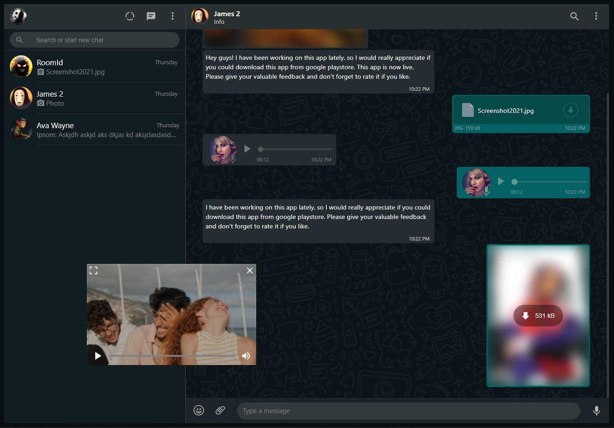

# Whatsapp Clone

## Origin State

\*(IMP): This project is not complete. You can see the progress by visiting the following link.

**Demo Link** 
https://whatsapp-clone-x2.web.app/

## Whatsapp clone using firebase:

A modified version of WhatsApp Web where you can create global rooms and chat in realtime. It uses firebase for google authentication and uses its NoSQL and SQL hybrid as database. It uses solid React Context API for the data layer.

**Repo link** 
https://github.com/joel-jaimon/whatsapp-clone/tree/e4967914370de302d5dd3f8bfb5fc88e82d2b147

**Demo Link** 
https://whatsapp-clone-738d9.web.app/

**Preview** 

